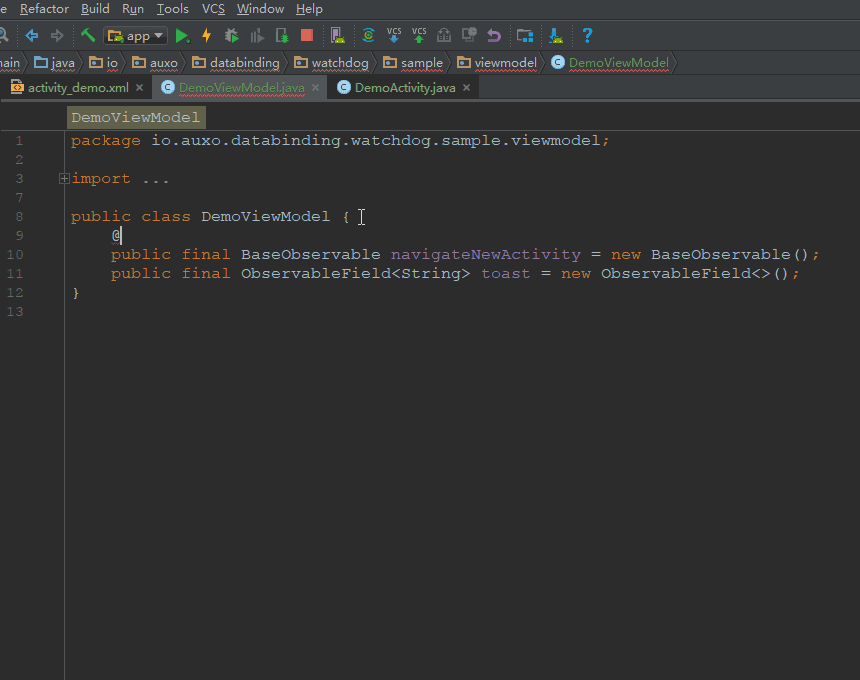

DataBinding-Watchdog
===


***Deprecated! Use LiveData instead.***


Interface generator and property change binding tool for observable field in android DataBinding.

* Generate callback interface for observable fields annotated with `@WatchThis`.
* Bind callback with `onPropertyChanged` event.

Download
---
```groovy
dependencies {
    compile 'io.auxo.databinding.watchdog:watchdog:2.0.0'
    annotationProcessor 'io.auxo.databinding.watchdog:compiler:2.0.0'
}
```



Before
---
```java
    public class ViewModel{
        public final BaseObservable a = new BaseObservable();
        public final ObservableInt b = new ObservableInt();
        public final ObservableField<String> c = new ObservableField<>();
    }

    public class DemoActivity extends Activity{
        @Override
        protected void onCreate(@Nullable Bundle savedInstanceState) {
            super.onCreate(savedInstanceState);
            ActivityLoginBinding binding = DataBindingUtil.setContentView(this, R.layout.content);
            ViewModel viewModel = new ViewModel();
            binding.setVariable(BR.data, viewModel);

            initA(viewModel);
            initB(viewModel);
            initC(viewModel);
        }
        protected void initA(ViewModel viewModel){
            viewModel.a.addOnPropertyChangedCallback(new Observable.OnPropertyChangedCallback() {
                @Override
                public void onPropertyChanged(Observable observable, int i) {

                }
            });
        }
        protected void initB(ViewModel viewModel){
            viewModel.b.addOnPropertyChangedCallback(new Observable.OnPropertyChangedCallback() {
                @Override
                public void onPropertyChanged(Observable observable, int i) {

                }
            });
        }
        protected void initC(ViewModel viewModel){
            viewModel.c.addOnPropertyChangedCallback(new Observable.OnPropertyChangedCallback() {
                @Override
                public void onPropertyChanged(Observable observable, int i) {

                }
            });
        }
    }
```

After
---
```java
    public class ViewModel {
        @WatchThis(method = "OnAChange")
        public final BaseObservable a = new BaseObservable();
        @WatchThis
        public final ObservableInt b = new ObservableInt();
        @WatchThis
        public final ObservableField<String> c = new ObservableField<>();
    }

    public class DemoActivity extends Activity implements IViewModelCallbacks {
        @Override
        protected void onCreate(@Nullable Bundle savedInstanceState) {
            super.onCreate(savedInstanceState);
            ActivityLoginBinding binding = DataBindingUtil.setContentView(this, R.layout.content);
            ViewModel viewModel = new ViewModel();
            binding.setVariable(BR.data, viewModel);

            Watchdog.watch(viewModel)
                    .addWatcher(this);
        }
        @Override
        public void OnAChange(BaseObservable observableField, int fieldId) {
        }
        @Override
        public void b(ObservableInt observableField, int fieldId) {
        }
        @Override
        public void c(ObservableField<String> observableField, int fieldId) {
        }
    }
```